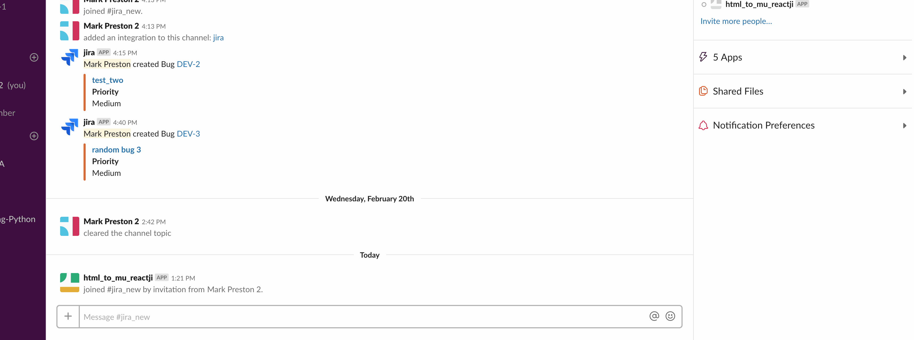

# HTML to MU Slack Reacji

Ever dumped a load of HTML into Slack and wish you didn't have to manually edit it? 

Fear not! 

Example Text:

```
<b>Hello</b><br>
There is <i>something</i> interesting about <code>this doc</code>
<p>
    And what about a <a href=“http://example.com/“>link?</a> </p> What about <strike>strikethrough</strike>?<br>
        or even a <ul>
            <li>list</li>
            <li>like</li>
            <li>this?</li>
            </ul><br>
        linebreaks? <br>
        You can't see them, but they are there.

```




